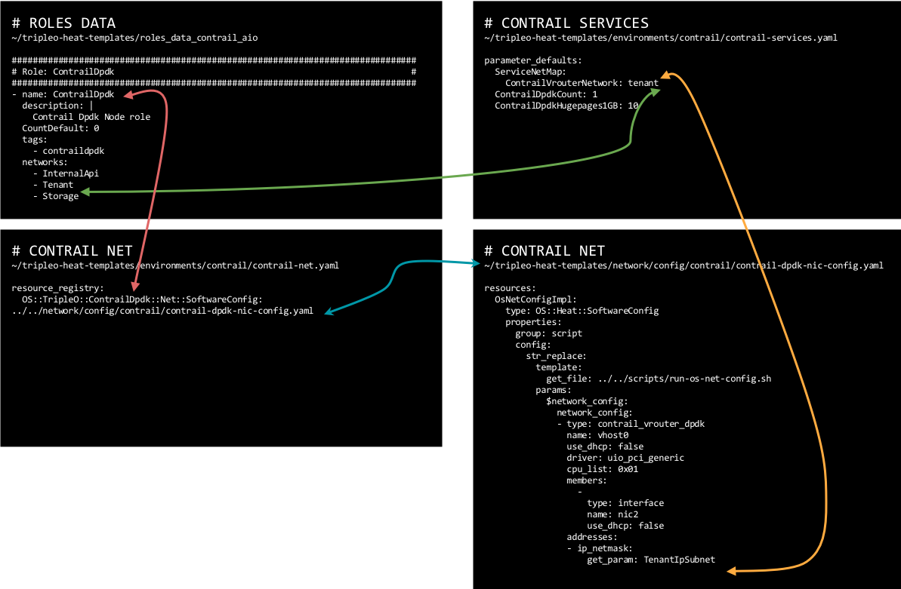

#########
Templates
#########

.. contents:: Table of Contents

The customization of the Overcloud is done in a set of different yaml templates

Contrail Services customization
===============================

.. code:: bash

   vi ~/tripleo-heat-templates/environments/contrail-services.yaml

.. code:: bash

   parameter_defaults:
     ContrailSettings:
       VROUTER_GATEWAY: 10.0.0.1
       # KEY1: value1
       # KEY2: value2

Contrail registry settings
==========================

.. code:: bash

   vi ~/tripleo-heat-templates/environments/contrail-services.yaml

.. admonition:: Public Juniper registry
   :class: red

     ::

        parameter_defaults:
          ContrailRegistry: hub.juniper.net/contrail
          ContrailRegistryUser: YOURUSER
          ContrailRegistryPassword: YOURPASSWORD

.. admonition:: Insecure registry
   :class: green

     ::

        parameter_defaults:
          ContrailRegistryInsecure: true
          DockerInsecureRegistryAddress: 10.87.64.32:5000,192.168.24.1:8787
          ContrailRegistry: 10.87.64.32:5000

.. admonition:: Private secure registry
   :class: violet

     ::

        parameter_defaults:
          ContrailRegistryCertUrl: http://satellite.englab.juniper.net/pub/satellite.englab.juniper.net.crt
          ContrailRegistry: satellite.englab.juniper.net:5443

Contrail container image settings
=================================

.. code:: bash

   parameter_defaults:
     ContrailImageTag: queens-5.0-104-rhel-queens

Overriding global setting for registry and tag for specific images
=================================

Each of the container image names may be given with registry and image tag, that will effectively override global values of registry and image tag given in `ContrailRegistry` and `ContrailImageTag`. Example of such setting is given below for each supported image name.

.. code:: bash

   parameter_defaults:
     DockerContrailAnalyticsAlarmGenImageName: satellite.englab.juniper.net:5443/contrail-analytics-alarm-gen:queens-5.0-104-rhel-queens
     DockerContrailAnalyticsApiImageName: satellite.englab.juniper.net:5443/contrail-analytics-api:queens-5.0-104-rhel-queens
     DockerContrailAnalyticsCollectorImageName: satellite.englab.juniper.net:5443/contrail-analytics-collector:queens-5.0-104-rhel-queens
     DockerContrailAnalyticsQueryEngineImageName: satellite.englab.juniper.net:5443/contrail-analytics-query-engine:queens-5.0-104-rhel-queens
     DockerContrailAnalyticsSnmpCollectorImageName: satellite.englab.juniper.net:5443/contrail-analytics-snmp-collector:queens-5.0-104-rhel-queens
     DockerContrailAnalyticsTopologyImageName: satellite.englab.juniper.net:5443/contrail-analytics-topology:queens-5.0-104-rhel-queens
     DockerContrailCassandraImageName: satellite.englab.juniper.net:5443/contrail-external-cassandra:queens-5.0-104-rhel-queens
     DockerContrailConfigApiImageName: satellite.englab.juniper.net:5443/contrail-controller-config-api:queens-5.0-104-rhel-queens
     DockerContrailConfigDevicemgrImageName: satellite.englab.juniper.net:5443/contrail-controller-config-devicemgr:queens-5.0-104-rhel-queens
     DockerContrailConfigSchemaImageName: satellite.englab.juniper.net:5443/contrail-controller-config-schema:queens-5.0-104-rhel-queens
     DockerContrailConfigSvcmonitorImageName: satellite.englab.juniper.net:5443/contrail-controller-config-svcmonitor:queens-5.0-104-rhel-queens
     DockerContrailControlControlImageName: satellite.englab.juniper.net:5443/contrail-controller-control-control:queens-5.0-104-rhel-queens
     DockerContrailControlDnsImageName: satellite.englab.juniper.net:5443/contrail-controller-control-dns:queens-5.0-104-rhel-queens
     DockerContrailControlNamedImageName: satellite.englab.juniper.net:5443/contrail-controller-control-named:queens-5.0-104-rhel-queens
     DockerContrailHeatPluginImageName: satellite.englab.juniper.net:5443/contrail-openstack-heat-init:queens-5.0-104-rhel-queens
     DockerContrailKafkaImageName: satellite.englab.juniper.net:5443/contrail-external-kafka:queens-5.0-104-rhel-queens
     DockerContrailNeutronPluginImageName: satellite.englab.juniper.net:5443/contrail-openstack-neutron-init:queens-5.0-104-rhel-queens
     DockerContrailNodeInitImageName: satellite.englab.juniper.net:5443/contrail-node-init:queens-5.0-104-rhel-queens
     DockerContrailNodemgrImageName: satellite.englab.juniper.net:5443/contrail-nodemgr:queens-5.0-104-rhel-queens
     DockerContrailNovaPluginImageName: satellite.englab.juniper.net:5443/contrail-openstack-compute-init:queens-5.0-104-rhel-queens
     DockerContrailRabbitmqImageName: satellite.englab.juniper.net:5443/contrail-external-rabbitmq:queens-5.0-104-rhel-queens
     DockerContrailStatusImageName: satellite.englab.juniper.net:5443/contrail-status:queens-5.0-104-rhel-queens
     DockerContrailVrouterAgentContainerName: satellite.englab.juniper.net:5443/contrail-vrouter-agent:queens-5.0-104-rhel-queens
     DockerContrailVrouterAgentDpdkContainerName: satellite.englab.juniper.net:5443/contrail-vrouter-agent-dpdk:queens-5.0-104-rhel-queens
     DockerContrailVrouterAgentImageName: satellite.englab.juniper.net:5443/contrail-vrouter-agent:queens-5.0-104-rhel-queens
     DockerContrailVrouterKernelInitDpdkImageName: satellite.englab.juniper.net:5443/contrail-vrouter-kernel-init-dpdk:queens-5.0-104-rhel-queens
     DockerContrailVrouterKernelInitImageName: satellite.englab.juniper.net:5443/contrail-vrouter-kernel-init:queens-5.0-104-rhel-queens
     DockerContrailWebuiJobImageName: satellite.englab.juniper.net:5443/contrail-controller-webui-job:queens-5.0-104-rhel-queens
     DockerContrailWebuiWebImageName: satellite.englab.juniper.net:5443/contrail-controller-webui-web:queens-5.0-104-rhel-queens
     DockerContrailZookeeperImageName: satellite.englab.juniper.net:5443/contrail-external-zookeeper:queens-5.0-104-rhel-queens
     DockerContrailRedisImageName: satellite.englab.juniper.net:5443/dockerio-redis:latest:queens-5.0-104-rhel-queens

Network customization
=====================

The depency of the different network related files is shown here:

In order to customize the network, different networks have to be defined and the
Overcloud nodes NIC layout has to be configured. Tripleo supports a flexible 
way of customizing the network. In this example the following networks are used:

+--------------+------+-------------------------+
| Network      | Vlan | Overcloud Nodes         |
+==============+======+=========================+
| provisioning |  -   | All                     | 
+--------------+------+-------------------------+
| internal_api | 710  | All                     |
+--------------+------+-------------------------+
| external_api | 720  | OpenStack CTRL          |
+--------------+------+-------------------------+
| storage      | 740  | OpenStack CTRL, Computes|
+--------------+------+-------------------------+
| storage_mgmt | 750  | OpenStack CTRL          |
+--------------+------+-------------------------+
| tenant       |  -   | Contrail CTRL, Computes |
+--------------+------+-------------------------+

Network activation in roles_data
--------------------------------

The networks must be activated per role in the roles_data file:

.. code-block:: bash

   vi ~/tripleo-heat-templates/roles_data_contrail_aio.yaml

OpenStack Controller
^^^^^^^^^^^^^^^^^^^^

.. code-block:: bash

      ###############################################################################
      # Role: Controller                                                            #
      ###############################################################################
      - name: Controller
        description: |
          Controller role that has all the controler services loaded and handles
          Database, Messaging and Network functions.
        CountDefault: 1
        tags:
          - primary
          - controller
        networks:
          - External
          - InternalApi
          - Storage
          - StorageMgmt

Compute Node
^^^^^^^^^^^^

.. code-block:: bash

      ###############################################################################
      # Role: Compute                                                               #
      ###############################################################################
      - name: Compute
        description: |
          Basic Compute Node role
        CountDefault: 1
        networks:
          - InternalApi
          - Tenant
          - Storage

Contrail Controller
^^^^^^^^^^^^^^^^^^^

.. code-block:: bash

      ###############################################################################
      # Role: ContrailController                                                    #
      ###############################################################################
      - name: ContrailController
        description: |
          ContrailController role that has all the Contrail controler services loaded
          and handles config, control and webui functions
        CountDefault: 1
        tags:
          - primary
          - contrailcontroller
        networks:
          - InternalApi
          - Tenant

Compute DPDK
^^^^^^^^^^^^

.. code-block:: bash

      ###############################################################################
      # Role: ContrailDpdk                                                          #
      ###############################################################################
      - name: ContrailDpdk
        description: |
          Contrail Dpdk Node role
        CountDefault: 0
        tags:
          - contraildpdk
        networks:
          - InternalApi
          - Tenant
          - Storage

Compute SRIOV
^^^^^^^^^^^^^

.. code-block:: bash

      ###############################################################################
      # Role: ContrailSriov
      ###############################################################################
      - name: ContrailSriov
        description: |
          Contrail Sriov Node role
        CountDefault: 0
        tags:
          - contrailsriov
        networks:
          - InternalApi
          - Tenant
          - Storage

Compute CSN
^^^^^^^^^^^

.. code-block:: bash

      ###############################################################################
      # Role: ContrailTsn
      ###############################################################################
      - name: ContrailTsn
        description: |
          Contrail Tsn Node role
        CountDefault: 0
        tags:
          - contrailtsn
        networks:
          - InternalApi
          - Tenant
          - Storage

Network parameter configuration
-------------------------------

.. code-block:: bash

   cat ~/tripleo-heat-templates/environments/contrail/contrail-net.yaml

.. literalinclude:: contrail-net.yaml
   :language: yaml

Network interface configuration
-------------------------------

There are NIC configuration files per role.

.. code-block:: bash

   cd ~/tripleo-heat-templates/network/config/contrail

OpenStack Controller
^^^^^^^^^^^^^^^^^^^^

.. literalinclude:: nics/controller-nic-config.yaml
   :language: yaml

Contrail Controller
^^^^^^^^^^^^^^^^^^^

.. literalinclude:: nics/contrail-controller-nic-config.yaml
   :language: yaml

Compute Node
^^^^^^^^^^^^

.. literalinclude:: nics/compute-nic-config.yaml
   :language: yaml

Advanced Network Configuration
------------------------------

.. toctree::
   :maxdepth: 3

   advanced/vrouter
   advanced/dpdk
   advanced/sriov

Advanced scenarios
==================

.. toctree::
   :maxdepth: 3

   advanced/remotecompute
